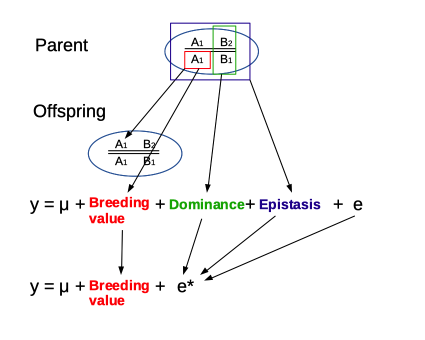
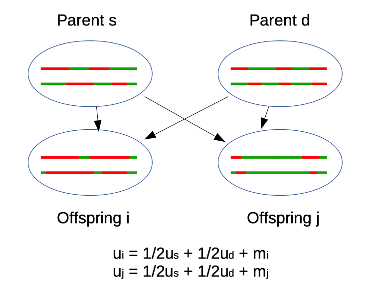
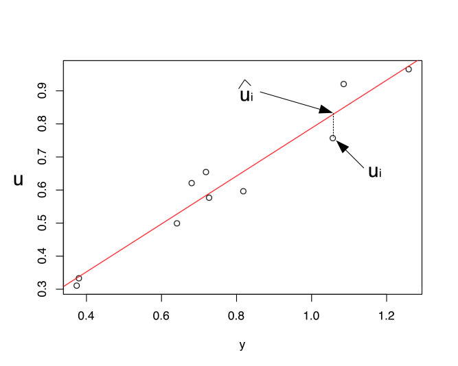

Genetic Evaluation
================
Peter von Rohr
02 Oktober 2020

## Consequences of Definition of Breeding Value

  - Based on the average of a large number of offspring, because
      - offspring inherit a random sample of parental alleles
      - average over a large number of offspring reduces sampling effect
  - The breeding value is defined as a deviation from the population
    mean
      - population mean depends on allele frequencies which are specific
        for each population
      - hence breeding values can only be compared within one
        population.
  - Because the breeding value is defined as a deviation its expected
    value of the breeding value is \(0\)

## The Basic Model

## Re-arranging Terms

<!-- -->

## New Model

## Infinitesimal Model

  - Central Limit Theorem for \(u_i\) and \(e_{ij}\) lead to
    **multivariate normal distributions** with
      - \(E(u) = 0\) and \(E(e) = 0\) and
      - Known variances and co-variances
      - No co-variances between \(u_i\) and \(e_{ij}\)
  - \(\mu\) is assumed to be constant for a given evaluation
  - Phenotypic observation \(y_{ij}\) is the sum of two normally
    distributed random variables, therefore
      - \(y_{ij}\) also follows a multivariate normal distribution
      - \(E(y) = \mu\)

## Central Limit Theorem

## Decomposition of Breeding Value

<!-- -->

## Basic Principle of Predicting Breeding Values

Breeding values are predicted according to the following two steps.

1.  Observations corrected for the appropriate mean performance values
    of animals under the same conditions
      - conditions are described by the effects captured in \(\mu_i\).
2.  The corrected observations are weighted by a certain factor
      - factor reflects the amount of information available for
        prediction

## Animal’s Own Performance - Single Record

  - one phenotypic observation per animal
  - search for prediction \(\hat{u_i}\) of the breeding value \(u_i\) of
    animal \(i\)  
  - assume \(u_i\) and \(y_i\) known for a certain population

\(\rightarrow\) plot

## Plot \(u\) against \(y\)

<!-- -->

## Regression

  - red line denotes **regression line** from \(u_i\) onto \(y_i\)
  - because phenotypes have genetic basis \(\rightarrow\) connection
    between \(u_i\) and \(y_i\)
  - measure for connection: regression coefficient \(b\)
  - new model can be interpreted as regression

## Regression Coefficient

where \(h^2\) is called **heritability**

## Prediction

  - Given a new \(y_i\), what would be the predicted \(u_i\)?
  - Use regression line and compute \(\hat{u_i}\)

## Accuracy

  - Measured as correlation between true breeding value \(u\) and
    selection criterion \(y\)

## Response To Selection

## Repeated Records

  - Additional component of variation

  - Predicted breeding value

## Regression Coefficient

## Putting Results together

## Progeny Records

where

## Covariance and Variance

with \(t = \sigma_u^2 / 4\)

## Intra-Class \(t\)

  - Progeny mean 

  - Variance 

with \(cov(.) = 0\), \(t = var({1 \over 2} u_i) / var(y) = h^2/4\)

## Results

with \(k=\frac{4-h^2}{h^2}\).
